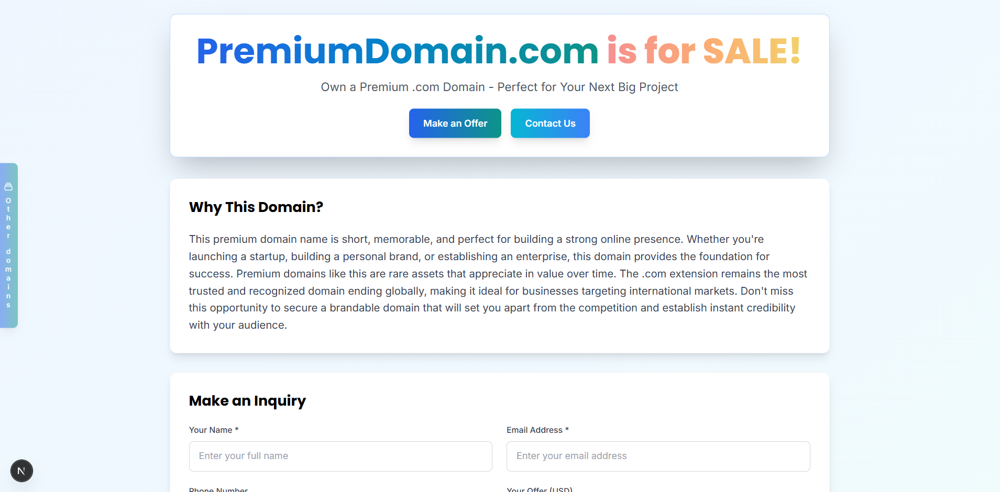

# Domain For Sale Boilerplate

A modern, open-source single page application for creating professional "Domain For Sale" websites. Built with **React 19** and **Next.js 16**, optimized for SEO, mobile-friendly, and ready to deploy on Netlify in minutes.

## 📸 Preview



*A beautiful, responsive landing page optimized for selling premium domains*

## ✨ Features

- **🚀 React 19 & Next.js 16** - Latest versions with App Router and server-side rendering for optimal performance
- **🎨 Modern UI with Tailwind CSS 3.4** - Beautiful, responsive design with gradient colors and smooth animations
- **📱 Mobile-First & Responsive** - Optimized for all devices with excellent UX
- **🔍 SEO Optimized** - Meta tags, structured data, and Core Web Vitals optimized
- **📧 EmailJS Integration** - Get email notifications for every inquiry directly to your inbox
- **🛡️ reCAPTCHA Protection** - Google reCAPTCHA v2 integration for spam prevention
- **📊 Google Analytics** - Built-in analytics tracking
- **⚡ Performance Optimized** - Core Web Vitals green scores
- **🔧 JSON Configuration** - Easy content management through single config file
- **🌟 Multiple Domain Showcase** - Floating sidebar widget to showcase your other domains
- **💲 Configurable Pricing** - Show/hide domain price with simple boolean toggle
- **📝 Show/Hide Inquiry Form** - Control contact form visibility (useful for sold domains)
- **🎯 Dual Content Strategy** - Short headline + detailed SEO description
- **🏗️ App Router Architecture** - Modern Next.js architecture for better performance
- **🌐 Platform Independent** - Works on any hosting platform (Netlify, Vercel, GitHub Pages, etc.)

## 🚀 Quick Start

### Prerequisites

- Node.js 18.18+ (required for Next.js 16)
- npm, yarn, pnpm, or bun
- [EmailJS account](https://www.emailjs.com/) (free tier: 200 emails/month) - **Required for form submissions**
- [Google reCAPTCHA account](https://www.google.com/recaptcha/admin) (free) - For spam protection
- Optional: [Netlify account](https://www.netlify.com/) (or any hosting platform like Vercel, GitHub Pages)

### Installation

#### Option 1: Using npx (Recommended)

```bash
npx domain-for-sale-boilerplate my-domain-site
cd my-domain-site
```

#### Option 2: Manual Clone

```bash
git clone https://github.com/vireshshah/domain-for-sale-boilerplate.git my-domain-site
cd my-domain-site
npm install
```

### Setup Steps

1. **Configure your domain information**
   
   Edit `config/domain-config.json` - this is the only file you need to customize:
   ```json
   {
     "seo": {
       "title": "Premium Domain For Sale - YourDomain.com",
       "description": "Your domain description for SEO",
       "keywords": "domain for sale, premium domain, your keywords"
     },
     "domain": {
       "name": "YourDomain.com",
       "price": "$5,999",
       "showPrice": false,
       "showInquiryForm": true,
       "headline": "Short catchy tagline for your domain",
       "description": "Detailed SEO-optimized description"
     },
     "contact": {
       "email": "your-email@domain.com",
       "name": "Your Name",
       "responseTime": "24 hours"
     },
     "emailjs": {
       "enabled": true,
       "publicKey": "your-emailjs-public-key",
       "serviceId": "your-service-id",
       "templateId": "your-template-id",
       "toEmail": "your-email@domain.com"
     }
   }
   ```

4. **Set up reCAPTCHA**
   - Go to [Google reCAPTCHA Admin Console](https://www.google.com/recaptcha/admin)
   - Click "+" to create a new site
   - Choose "reCAPTCHA v2" → "I'm not a robot" Checkbox
   - Add your domains: `yourdomain.com`, `localhost`, `netlify.app`
   - Copy the **Site Key** and update `config/domain-config.json`:
   ```json
   "recaptcha": {
     "siteKey": "your-actual-site-key-here"
   }
   ```
   
   **For testing**, the current test key will work on any domain but shows test warnings.

5. **Set up EmailJS (Required for form submissions)**
   
   EmailJS handles all form submissions and sends inquiries directly to your email.
   
   - Sign up at [EmailJS.com](https://www.emailjs.com/) (free tier: 200 emails/month)
   - Create an email service (connect Gmail, Outlook, etc.)
   - Create an email template with these variables:
     ```
     {{from_name}}, {{reply_to}}, {{phone}}, {{offer}}, {{currency}}, 
     {{message}}, {{domain_name}}, {{submission_date}}, {{to_email}}
     ```
   - Get your Public Key, Service ID, and Template ID from EmailJS dashboard
   - Update `config/domain-config.json`:
   ```json
   "emailjs": {
     "enabled": true,
     "publicKey": "your-emailjs-public-key",
     "serviceId": "your-service-id", 
     "templateId": "your-template-id",
     "toEmail": "your-email@domain.com"
   }
   ```
   
   💡 **Tip:** EmailJS works in development mode too, so you can test locally!

6. **Run development server**
   ```bash
   npm run dev
   ```
   Open [http://localhost:3000](http://localhost:3000) to view your site.

## 🎯 Configuration Guide

### Domain Configuration (`config/domain-config.json`)

The entire website content is managed through a single JSON configuration file with the following key features:

- **Dual Content Strategy**: Short `headline` for hero section, detailed `description` for SEO
- **Configurable Price Display**: Toggle price visibility with `showPrice` boolean
- **EmailJS Integration**: All form submissions sent directly to your email
- **Platform Independent**: Deploy anywhere - Netlify, Vercel, GitHub Pages, or any static host

#### SEO Settings
```json
"seo": {
  "title": "Premium Domain For Sale - YourDomain.com",
  "description": "Your SEO description",
  "keywords": "domain for sale, premium domain, buy domain",
  "ogImage": "/images/og-image.jpg",
  "favicon": "/favicon.ico"
}
```

#### Domain Information
```json
"domain": {
  "name": "YourDomain.com",
  "price": "$2,999",
  "priceNumeric": 2999,
  "currency": "USD",
  "showPrice": false,
  "showInquiryForm": true,
  "headline": "Short catchy tagline displayed in hero section",
  "description": "Detailed SEO-optimized description for 'Why This Domain' section"
}
```

**Configuration Options:**
- `showPrice`: Set to `true` to display the domain price in the hero section
- `showInquiryForm`: Set to `false` to hide the "Make an Offer" button and contact form (useful for sold domains or pre-launch pages)

#### Contact Information
```json
"contact": {
  "email": "your-email@domain.com",
  "name": "Your Name",
  "responseTime": "24 hours"
}
```

#### Other Domains Showcase
```json
"otherDomains": [
  {
    "name": "TechStartup.com",
    "url": "https://techstartup.com"
  }
]
```

## 📈 Analytics Setup

### Google Analytics (Optional)
1. Create a [Google Analytics 4](https://analytics.google.com/) account
2. Create a new property and get your Measurement ID (G-XXXXXXXXXX)
3. Update `config/domain-config.json`:
```json
"analytics": {
  "googleAnalytics": {
    "enabled": true,
    "trackingId": "G-XXXXXXXXXX"
  }
}
```

**Note:** Set `enabled: false` to disable analytics tracking.

## 🚀 Deploy to Any Platform

### Deploy to Netlify (Recommended)

#### Method 1: Deploy with Git (Auto-deployment)

1. **Push your code to GitHub**
   ```bash
   git add .
   git commit -m "Initial commit"
   git push origin main
   ```

2. **Deploy on Netlify**
   - Go to [Netlify](https://app.netlify.com/) and sign in
   - Click **"Add new site"** → **"Import an existing project"**
   - Choose **GitHub** and select your repository
   - Netlify will auto-detect the settings from `netlify.toml`:
     - Build command: `npm run build`
     - Publish directory: `.next`
   - Click **"Deploy site"**

3. **Configure your custom domain**
   - In Netlify dashboard, go to **"Site settings"** → **"Domain management"**
   - Click **"Add custom domain"**
   - Enter your domain (e.g., `yourdomain.com`)
   - Follow the DNS configuration instructions

✅ **Done!** Your site is live and will auto-deploy on every git push.

#### Method 2: Manual Deploy via Netlify CLI

1. **Install Netlify CLI**
   ```bash
   npm install -g netlify-cli
   ```

2. **Build and deploy**
   ```bash
   npm run build
   netlify deploy --prod
   ```

#### Method 3: Drag & Drop Deploy

1. **Build the project locally**
   ```bash
   npm run build
   ```

2. **Deploy**
   - Go to [Netlify Drop](https://app.netlify.com/drop)
   - Drag and drop the `.next` folder

### Deploy to Vercel

1. Install Vercel CLI: `npm install -g vercel`
2. Run: `vercel`
3. Follow the prompts

### Deploy to GitHub Pages

1. Add to `next.config.js`:
   ```js
   output: 'export',
   basePath: '/your-repo-name'
   ```
2. Run: `npm run build`
3. Deploy the `out` folder to GitHub Pages

### Important: No Environment Variables Needed!

All configuration (EmailJS, reCAPTCHA, Analytics) is in `config/domain-config.json` - no environment variables required!

## 📧 How Form Submissions Work

This boilerplate uses **EmailJS** for form submissions, which means:

✅ **Works on any hosting platform** (Netlify, Vercel, GitHub Pages, etc.)
✅ **No server-side code needed** - runs entirely in the browser
✅ **Direct email delivery** to your inbox
✅ **Works in development mode** - test locally before deploying
✅ **Free tier available** - 200 emails/month

### How it works:
1. User fills out the contact form
2. User completes reCAPTCHA (spam protection)
3. Form data is sent via EmailJS API
4. You receive an email with the inquiry details
5. User sees a success message

### Email Template Variables

Your EmailJS template receives these variables:
- `{{from_name}}` - Inquirer's name
- `{{reply_to}}` - Inquirer's email
- `{{phone}}` - Phone number (optional)
- `{{offer}}` - Offer amount
- `{{currency}}` - Currency (USD, EUR, etc.)
- `{{message}}` - Message text
- `{{domain_name}}` - Your domain name
- `{{submission_date}}` - Timestamp
- `{{to_email}}` - Your email address

### Troubleshooting

If form submissions aren't working:
1. Check EmailJS credentials in `domain-config.json`
2. Verify your EmailJS template has all required variables
3. Check browser console for errors
4. Ensure `emailjs.enabled` is set to `true`
5. Test with EmailJS dashboard's test feature

## 🎨 Customization

### Colors and Fonts

The design uses a modern blue/teal color palette defined in `tailwind.config.js`:

- **Primary**: Blue shades (blue-600, blue-700) for main elements
- **Secondary**: Teal shades (teal-500, teal-600) for accents  
- **Complementary**: Sky shades (sky-500, sky-600) for variety
- **Success**: Green shades for success states

Fonts:
- **Inter**: Body text (clean and readable)
- **Poppins**: Headings (modern and bold)

### Page Layout

- **Hero Section**: Eye-catching domain name with animated "is for SALE!" text and gradient colors
- **Description Section**: SEO-optimized "Why This Domain?" section
- **Contact Form**: Professional inquiry form with reCAPTCHA protection and offer field
- **Other Domains Widget**: Floating sidebar to showcase your domain portfolio
- **Configurable Elements**: Price and inquiry form visibility controlled via JSON config

## 📱 Core Web Vitals Optimization

The boilerplate is optimized for excellent Core Web Vitals scores:

- **Largest Contentful Paint (LCP)**: < 2.5s
- **First Input Delay (FID)**: < 100ms
- **Cumulative Layout Shift (CLS)**: < 0.1

Optimizations include:
- Image optimization
- Font preloading
- CSS optimization
- JavaScript code splitting
- Preconnect to external domains

## 🤝 Contributing

Contributions are welcome! Please feel free to submit a Pull Request.

## 📄 License

This project is licensed under the MIT License - see the [LICENSE](LICENSE) file for details.

**Made with ❤️ for the domain selling community** 